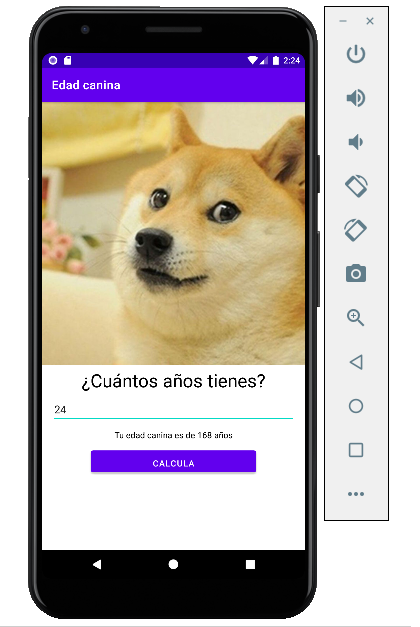

# Aplicación Mi Edad Canina

Esta aplicación calcula la edad en años que tendría un perro dada la edad del usuario, suponiendo que un año humano equivale a siete años caninos. La aplicación soporta los idiomas inglés y español, y sólo permite ingresar números, más aún, el usuario debe ingresar un número: si el usuario no lo hace y da click en el botón _CALCULAR_, el usuario obtiene un mensaje para que ingrese su edad. A manera de optimización, la aplicación hace uso de la biblioteca <a href="https://developer.android.com/topic/libraries/data-binding">Data Binding</a>.

La aplicación usa el lenguaje <a href="https://kotlinlang.org/">Kotlin</a> y fue realizada en la IDE <a href="https://developer.android.com/studio">Android Studio</a>. A continuación se muestra la aplicación funcionando:

Esta aplicación se realizó como parte del curso <a href="https://www.udemy.com/course/android-completo-con-kotlin/">Android Completo con Kotlin: Aprende creando apps</a>